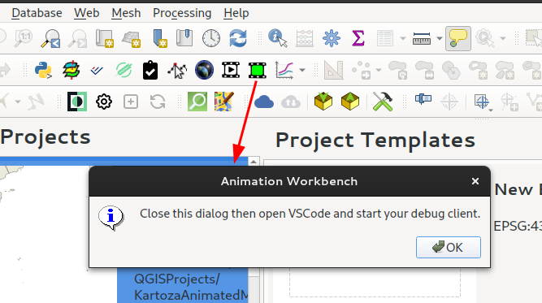
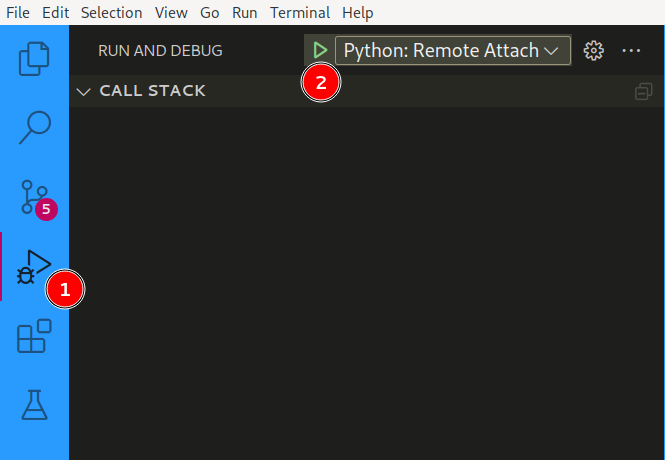

# Developer Environment

In this section, we walk you through setting up a development environment and
describe common workflows for debugging etc.

## Setup

Fork the `main` branch into your personal repository. Clone it to your local
computer. Install QGIS and the following dependencies.

- debugpy (python library)
- convert (imagemagick)
- ffmpeg
- vscode (don't use flatpak, debugging will not work with QGIS)

Clone the repo and symlink the `animation_workbench` subfolder into your profile.
Remember to change `<profile>` in the line below with the actual name of the
profile you will be using.

```sh
git clone https://github.com/{your-personal-repo}/QGISAnimationWorkbench.git
ln -s animation_workbench ~.local/share/QGIS/QGIS3/profiles/<profile>/python/plugins
```

Enable the plugin in the QGIS plugin manager. You should also install the
[Plugin Reloader](https://plugins.qgis.org/plugins/plugin_reloader/) plugin so
you can quickly deploy changes to your local session in QGIS as you are
working.

## Debugging

We use the VSCode remote debugger with `debugpy` in order to carry our
debugging workflows such as setting breakpoints, inspecting the application
state, stepping through code etc. 

To start debugging, you need to put the plugin into developer mode.



Next, open the QGIS Animation Workbench git checkout (as described above), and
then active the `Run and Debug` tab (1 in the image below). From the list of
launchers, choose `Python: Remote Attach` and press the green run icon (2 in
the image below).



The animation workbench will then resume normal operation, but you will be able
to set breakpoints and inspect objects in CSCode. Please refer to VSCode
documentation for the actual nuts and bolts of using their debugging tools.

## Packaging

Every time a merge is made to the main branch, a package is built automatically.

``` sh
TODO
```

#### Run test

``` sh
TODO
```
