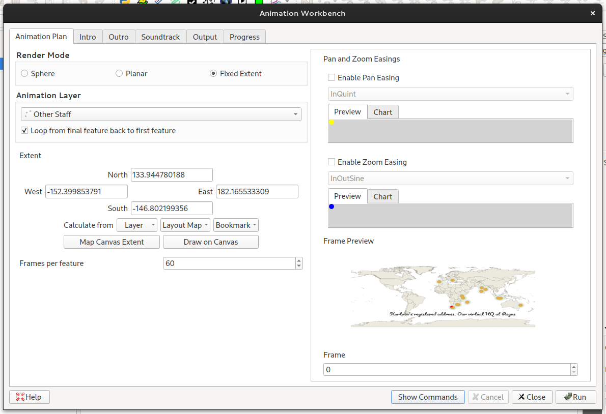
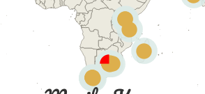
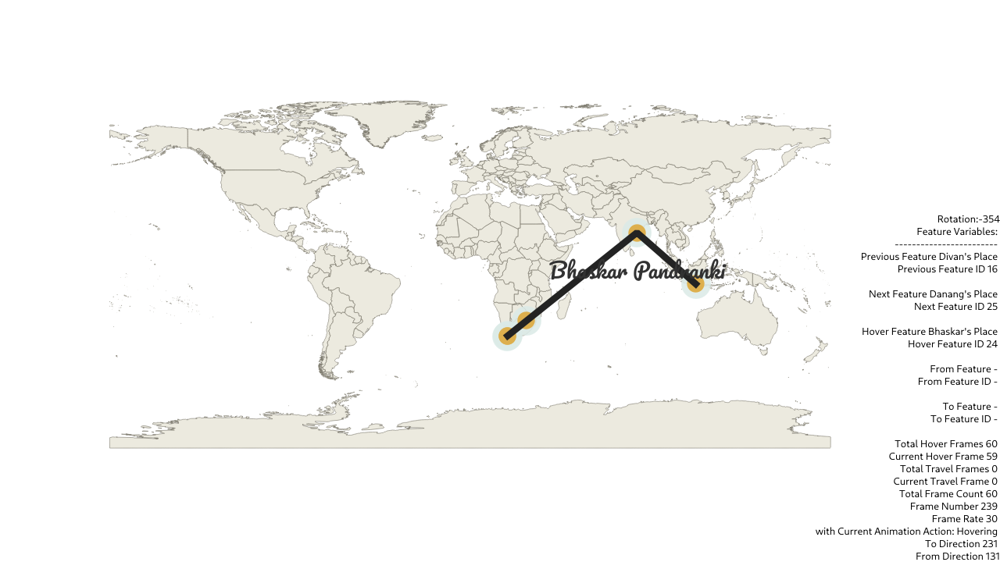
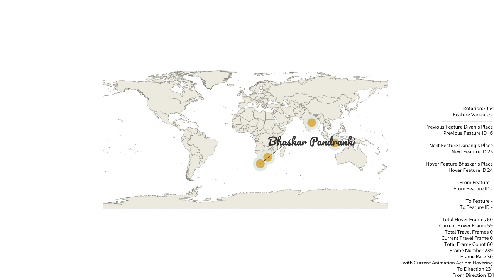
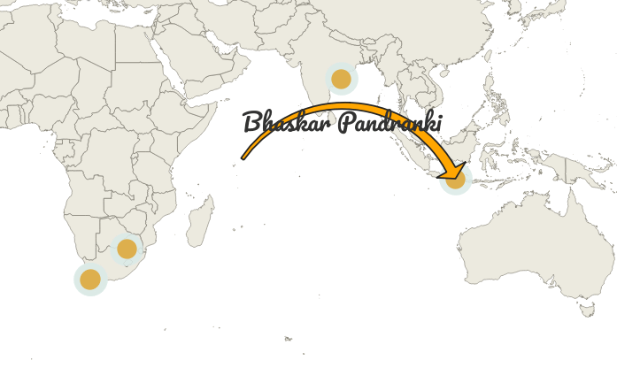

# Tutorial 5: Planar Map Animation

Given a global point layer and countries layer like this:


You can create a nice planar map animation effect like this:


In planar mode, we do not pan and zoom the map from feature to feature. Rather, the map zoom stays constant and the variables for 

* current_hover_frame
* hover_frames
* hover_feature_id

are updated as we iterate over the features of your animation layer. In this
example project I duplicated the animation point layer twice. The first (lower)
copy is used to 'drive' the animation, whilst the second (upper) layer shows
only the feature currently being hovered over, with animation effects applied
to that feature.

I set up the animation workbench like this:



For the above animated GIF, I compressed it using imagemagick like this:

```
convert globe.gif -coalesce -resize 700x525 -fuzz 2% +dither -layers Optimize +map globe_small.gif
```

This is a handy technique if you want to generate small file size animations.


## Expressions Used

### Copyright Decoration

Firstly for debugging, we use the following copyright label in View ⇒
Decorations ⇒ Copyright Label. You can use the checkbox in the Copyright
configuration dialog to toggle this on and off. This will help you while
debugging / tweaking your animations. When you are ready to render your final
product, simply turn it off before rendering.

```
[%
' \nRotation:' ||  to_string( 0-((1440 * (@current_hover_frame/@hover_frames)) % 360)) ||
'\nFeature Variables:' ||
' \n------------------------' ||
' \nPrevious Feature ' || to_string(coalesce(attribute(@previous_feature, 'name'), '-'))  ||
' \nPrevious Feature ID ' || to_string(coalesce(@previous_feature_id, '-'))  ||
' \n' ||
' \nNext Feature ' || to_string(coalesce(attribute(@next_feature, 'name'), '-'))  ||
' \nNext Feature ID ' || to_string(coalesce(@next_feature_id, '-'))  ||
' \n' ||
' \nHover Feature ' || to_string(coalesce(attribute(@hover_feature, 'name'), '-'))  ||
' \nHover Feature ID ' || to_string(coalesce(@hover_feature_id, '-'))  ||
' \n' ||
' \nFrom Feature ' || to_string(coalesce(attribute(@from_feature, 'name'), '-'))  ||
' \nFrom Feature ID ' || to_string(coalesce(@from_feature_id, '-'))  ||
' \n' ||
' \nTo Feature ' || to_string(coalesce(attribute(@to_feature, 'name'), '-'))  ||
' \nTo Feature ID ' || to_string(coalesce(@to_feature_id, '-'))  ||
' \n' ||
' \nTotal Hover Frames ' || to_string(coalesce(@hover_frames, 0))  ||
' \nCurrent Hover Frame ' || to_string(coalesce(@current_hover_frame, 0))  ||
' \nTotal Travel Frames ' || to_string(coalesce(@travel_frames, 0))  ||
' \nCurrent Travel Frame ' || to_string(coalesce(@current_travel_frame, 0))  ||
' \nTotal Frame Count ' || to_string(coalesce(@total_frame_count, 0))  ||
' \nFrame Number ' || to_string(coalesce(@frame_number, 0))  ||
' \nFrame Rate ' || to_string(coalesce(@frame_rate, 0))  ||
' \nwith Current Animation Action: ' || @current_animation_action ||
' \nTo Direction ' ||  coalesce(format_number(degrees(azimuth( geometry(@hover_feature), geometry(@previous_feature) ) ) ), 0) || 
' \nFrom Direction ' ||  coalesce(format_number(degrees( azimuth( geometry(@hover_feature), geometry(@next_feature) ) ) ), 0)%]
``` 

### Symbol Rotation

For the points I made a red marker using a quarter circle that spins around the
points like this:



The first line of the listing from the previous section  gives you a hint about
how we can vary the rotation of a symbol depending on how far through the
animation sequence we are. With the addition of an ``if`` clause, we can apply
this rotation only to features that are being hovered over during the planar
animation.

```
if (
  @id = @hover_feature_id, 
  0-((1440 * (@current_hover_frame/@hover_frames)) % 360), 
  0)
```

This ``if`` clause has the effect of excluding calculation for any feature that is not the current hover feature.

This will spin around 4 times during the hover cycle. This is because four
rotations are ``4 x 360 = 1440``. We calculate the percentage of completion for
the current hover frame (``@current_hover_frame/@hover_frames``) and then
multiply our rotation product by the current completion percentage. Lastly we
calculate the modulus of this (`` % 360``) to compute how far along we are in
the current rotation. More advanced users could substitute 1440 with a project
variable so that it is easy to change the number of desired rotations in a
single place.

### Symbol Size


The rotating symbol layer and the other symbol layers in our animation layer are
similarly hidden if the feature being rendered is not the ``hover_feature_id``
using an expression like this:

```
if ( @id = @hover_feature_id,  10, 0)
```

This has the effect of setting the symbol size to 0 if it is not the feature we
are focussing on.

## Other Planar Experiments

With the basic concepts of working with planar animations covered above, you can do other interesting things.

### Generate a line

In this example, we can generate a line using the Geometry Generator function in QGIS. The line will start from the previous point, extend through the current point and terminate and the next point.



```
if ( 
  $id = @hover_feature_id,
   make_line(
    geometry(@previous_feature),
	geometry(@hover_feature),
	geometry(@next_feature)
  ),
  $geometry)
```

We wrap it in an if clause again so that the line is not rendered if the
current feature being rendered is not the same as the current animation
feature.

There may be some edge cases where there is no previous or next feature. This
example does not try to deal with these cases but you could easily add some
logic that checks if each of the three components making up the line is null or
not.

### Generate a curve

We can extend the above example by creating a curve rather than a line, for a
more natural looking connection between the hover feature and its previous and
following feature.


```
if ( 
  $id = @hover_feature_id,
   smooth(
    make_line(
      geometry(@previous_feature),
	  geometry(@hover_feature),
	  geometry(@next_feature)
    ),
	iterations:=1,
	offset:=0.2,
	min_length:=-1,
	max_angle:=180),
  $geometry)
```

If you increase the number of iterations, you can achieve a more and more
smoothed out line, at the expense of processing time.


```
if ( 
  $id = @hover_feature_id,
   smooth(
    make_line(
      geometry(@previous_feature),
	  geometry(@hover_feature),
	  geometry(@next_feature)
    ),
	iterations:=5,
	offset:=0.2,
	min_length:=-1,
	max_angle:=180),
  $geometry)
```

### Subtring the Line

As a much more advanced example, you can extract a substring of the smoothed
line that connects the previous, current and next features. Don't get put off
by the ``with_variable`` elements - they just allow us to re-use calculations
in our expression.

First, let's start with extracting the first half of the smoothed line:



```
if ( 
    $id = @hover_feature_id,
    with_variable(
        'smoothed_line',
        smooth(
          make_line(
              geometry(@previous_feature),
	            geometry(@hover_feature),
	            geometry(@next_feature)
          ),
	  iterations:=5,
	  offset:=0.2,
	  min_length:=-1,
	  max_angle:=180),
	      with_variable(
	          'line_length',
		  length(@smoothed_line),
		  line_substring(@smoothed_line, 0, @line_length / 2 ))),
  $geometry)
```

### Animating the substring

If we follow the same approach as above, but vary the start and length of the
line clip, we can create some cool line animation effects.


```
if ( 
    $id = @hover_feature_id,
    with_variable(
        'smoothed_line',
        smooth(
          make_line(
              geometry(@previous_feature),
	            geometry(@hover_feature),
	            geometry(@next_feature)
          ),
	  iterations:=5,
	  offset:=0.2,
	  min_length:=-1,
	  max_angle:=180),
	      with_variable(
	          'line_length',
		  length(@smoothed_line),
		  line_substring(
                    @smoothed_line, 
                    @line_length * (@current_hover_frame/@hover_frames), 
                    @line_length ))),
  
  $geometry)

``` 

## Final Render

There are still a few details that would need to be taken care of to reach a
final solution - in particular taking care of datelines and the like. But here is
a little example of what we managed to make thus far (without any debugging
text).




