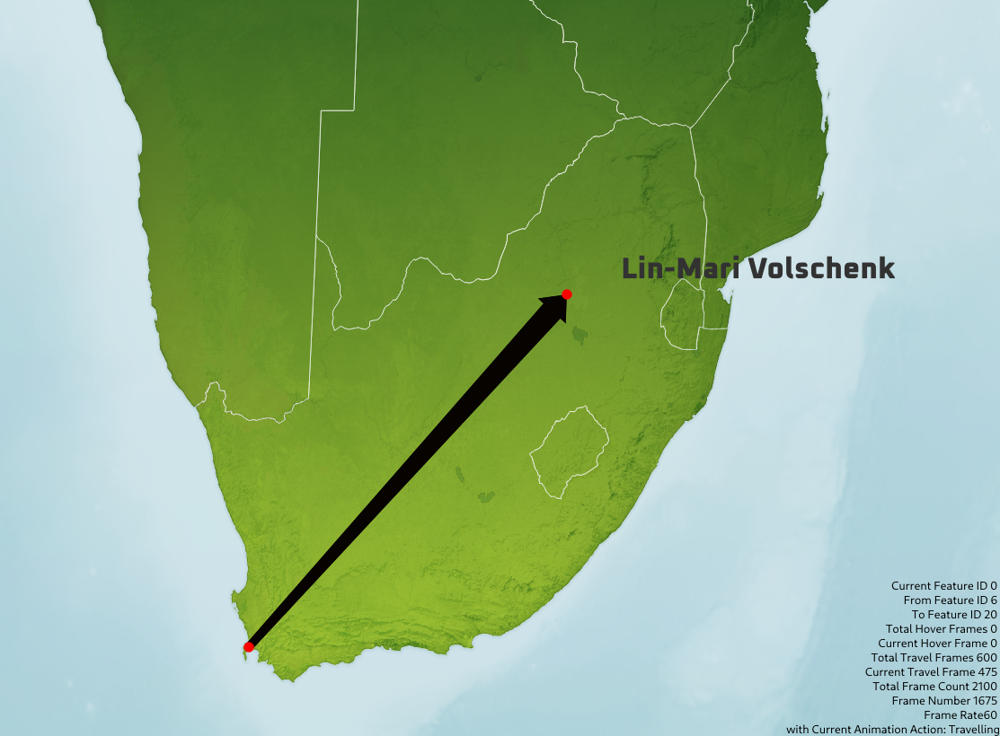
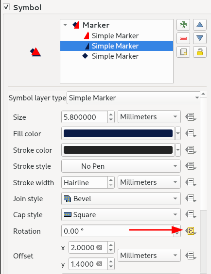
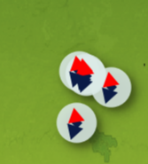
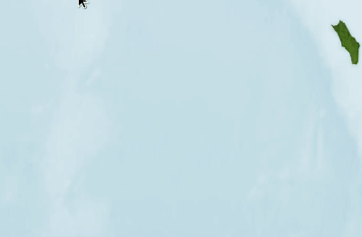
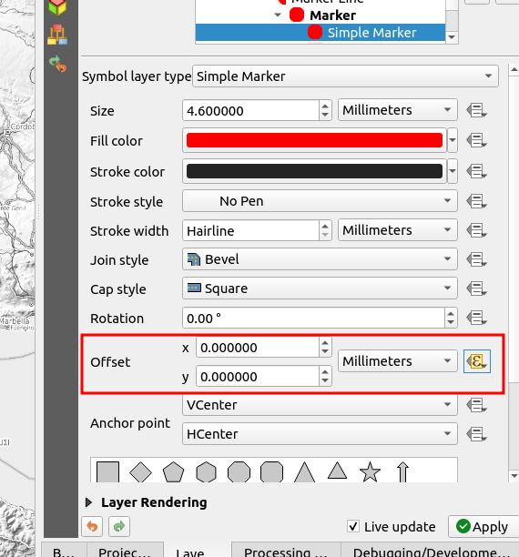

# Snippets

## 🌏 QGIS Support

Should work with and version of QGIS 3.x. If you have QGIS 3.26 or better you can benefit from the animated icon support (see @nyalldawson's most excellent patch [#48060](https://github.com/qgis/QGIS/pull/48060)).

For QGIS versions below 3.26, you can animate markers by unpacking a GIF image into its constituent frames and then referencing a specific frame from the symbol data defined property for the image file. Note that to do this extraction below you need to have the [Open Source ImageMagick application](https://imagemagick.org/script/download.php) installed:

First extract a gif to a sequence of images:

```
convert cat.gif -coalesce cat_%05d.png
```

Example of how to create a dynamically changing image marker based on the current frame count:

```
@project_home 
||
'/gifs/cat_000'
|| 
lpad(to_string( @frame_number % 48 ), 2, '0')
|| 
'.png'
```

Note that for the above, 48 is the number of frames that the GIF was composed of, and it assumes the frames are in the project directory in a subfolder called ``gifs``.

## Line of travel

In this example we use a geometry generator to create a line between the origin point and the destination point:

```
if (@from_feature_id = $id OR @to_feature_id = $id,
 -- read this from inside to out so 
 -- last tranform the geometry back to the map crs
 transform( 
  -- densify the geometry so that when we transform
  -- back it makes a great circle
  densify_by_count(  
   -- move the geometry into a crs that 
   -- shows a great circle as a straight line
   transform( 
    -- make a line from the previous pont to the next point
    make_line( 
     geometry(@from_feature), 
     geometry(@to_feature)
    ),  
    @map_crs, 'EPSG:4326'),
   99), 
  'EPSG:4326',  @map_crs),
 None)
```



## Showing diagnostic info as a copyright label

Showing diagnostic information in the QGIS copyright label:

```
[%
'Feature Variables:' ||
' \n------------------------' ||
' \nPrevious Feature ' || to_string(coalesce(attribute(@previous_feature, 'name'), '-'))  ||
' \nPrevious Feature ID ' || to_string(coalesce(@previous_feature_id, '-'))  ||
' \n' ||
' \nNext Feature ' || to_string(coalesce(attribute(@next_feature, 'name'), '-'))  ||
' \nNext Feature ID ' || to_string(coalesce(@next_feature_id, '-'))  ||
' \n' ||
' \nHover Feature ' || to_string(coalesce(attribute(@hover_feature, 'name'), '-'))  ||
' \nHover Feature ID ' || to_string(coalesce(@hover_feature_id, '-'))  ||
' \n' ||
' \nFrom Feature ' || to_string(coalesce(attribute(@from_feature, 'name'), '-'))  ||
' \nFrom Feature ID ' || to_string(coalesce(@from_feature_id, '-'))  ||
' \n' ||
' \nTo Feature ' || to_string(coalesce(attribute(@to_feature, 'name'), '-'))  ||
' \nTo Feature ID ' || to_string(coalesce(@to_feature_id, '-'))  ||
' \n' ||
' \nTotal Hover Frames ' || to_string(coalesce(@hover_frames, 0))  ||
' \nCurrent Hover Frame ' || to_string(coalesce(@current_hover_frame, 0))  ||
' \nTotal Travel Frames ' || to_string(coalesce(@travel_frames, 0))  ||
' \nCurrent Travel Frame ' || to_string(coalesce(@current_travel_frame, 0))  ||
' \nTotal Frame Count ' || to_string(coalesce(@total_frame_count, 0))  ||
' \nFrame Number ' || to_string(coalesce(@frame_number, 0))  ||
' \nFrame Rate ' || to_string(coalesce(@frame_rate, 0))  ||
' \nwith Current Animation Action: ' || @current_animation_action ||
' \nTo Direction ' ||  coalesce(format_number(degrees(azimuth( geometry(@hover_feature), geometry(@previous_feature) ) ) ), 0) || 
' \nFrom Direction ' ||  coalesce(format_number(degrees( azimuth( geometry(@hover_feature), geometry(@next_feature) ) ) ), 0)
%]


```

Example output:


## Variable size of labels

Variably changing the size on a label as we approach it in the animation:

```40 * ((@frame_number % @hover_frames) /  @hover_frames)
```

## Calculating the angle between points

You can calculate the angle between the hover point and the previous point like this:

```python
coalesce(
 format_number(
  degrees( 
   azimuth( 
    geometry(@hover_feature), 
    geometry(@previous_feature) 
   )
  )
 ), 0)
```

## Rotation

You can set the angle of rotation for a symbol using this expression:





Using this technique you can also create an animation effect showing the source
direction of travel and the new destination.

```python
scale_linear (
 @current_hover_frame,
 0,
 @hover_frames,
 degrees( 
  azimuth( 
   geometry(@hover_feature), 
   geometry(@previous_feature) 
  )
 ),
 degrees( 
  azimuth( 
   geometry(@hover_feature), 
   geometry(@next_feature) 
  )
 )
)
```

Will produce something like this:



## Flying points cluster

Here is an example where we animate all the points in a cluster that are **not** the hover point. We use an easing function to make the animation have an interesting circular motion.


```sql
-- Taken from https://spicyyoghurt.com/tools/easing-functions
--    t = Time - Amount of time that has passed since the beginning of the animation. Usually starts at 0 and is slowly increased using a game loop or other update function.
--    b = Beginning value - The starting point of the animation. Usually it's a static value, you can start at 0 for example.
--    c = Change in value - The amount of change needed to go from starting point to end point. It's also usually a static value.
--    d = Duration - Amount of time the animation will take. Usually a static value aswell.
-- Sinusoidal
-- -c / 2 * (Math.cos(Math.PI * t / d) - 1) + b;

-- Use with the animation in static mode
if(@hover_feature_id != $id,
array(
  (-@hover_frames / 2) * (cos( (pi() * @frame_number / @hover_frames ) - 1)) ,
 (-@hover_frames / 2) * (sin( (pi() * @frame_number / @hover_frames ) - 1)) 
),
array (0,0))

```

This function should be applied to the offset X,Y property of the symbol.


